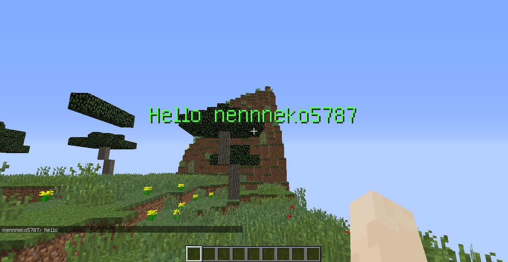

<h1>HomuraMC</h1>

a Minecraft server software

<pre><code class="python">from classes import HomuraServerProtocol

class HomuraMCPlugin():
	@staticmethod
	def onChat(self,p_text):
		if p_text == "hello":
			self.send_packet('title',
					self.buff_type.pack_varint(0),
					self.buff_type.pack_chat(f"§aHello {self.display_name}"),
				)
</code></pre>
</img>